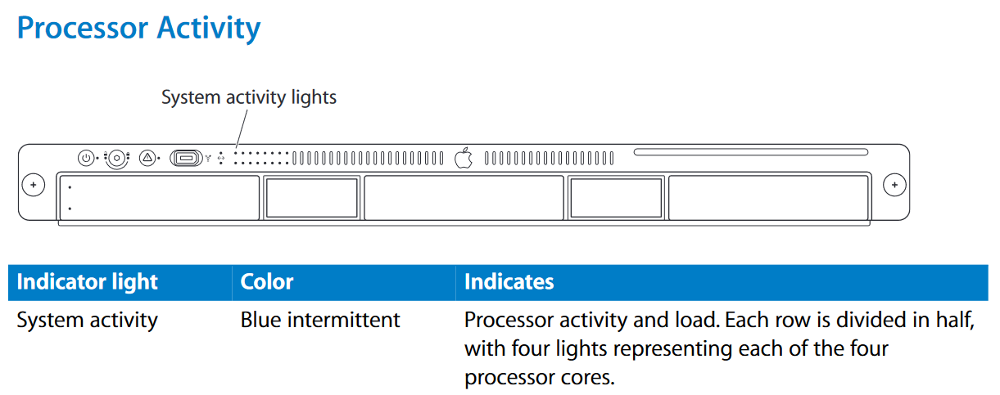

# xserve-frontpanel-dkms

A DKMS wrapper for Rene Rebe's [xserve-frontpanel](https://svn.exactcode.de/t2/trunk/package/kernel/linux/xserve-frontpanel.patch) Linux patch.  No need to wait for the code to be committed into a future Linux release, and no need to build your own kernel.

## Dependencies
dkms
make
gcc
linux-headers

## Installation
Just run the 'runme.sh' script as root with the argument 'install' or 'uninstall', i.e.
`sudo runme.sh install`

